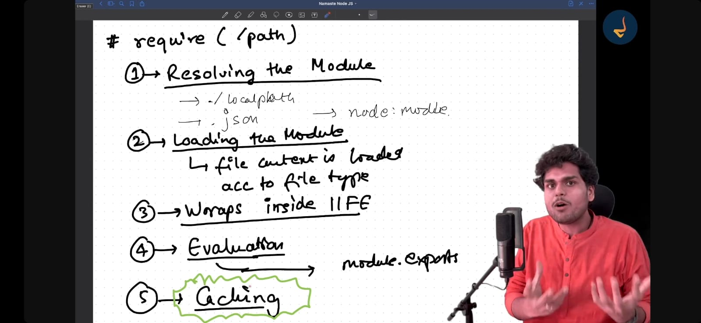

## Namstey NodeJs

Modules are protected by default

### Two types of modules 
1 . Common Js
 ( By default used in NodeJs)
 Older way .
 It requires any module in a Synchrounous way .
 Code run in non strict mode .
2 . ES modules
 ( By default used in Reactjs , Angular)
 Newer way . 
 It imports code in Asynchrounous way .
  Code run in  strict mode .

### module.exports
module.exports is an empty object if we console it and we are attaching properties like this 
 module.exports.calculateSum = calculateSum
module.exports.x = x 

## calculate > index.js
We are importing all files in index.js and then we are importing it from one file .

## Require

When we write require any module then nodejs wrap inside IIFE and then calls it 

### Q . How variables and functions private in different modules ?

### A.  Because of IIFE & require ( statement )

## NodeJs wraps everthing inside IIFE and also pass module , export along with IIFE .

